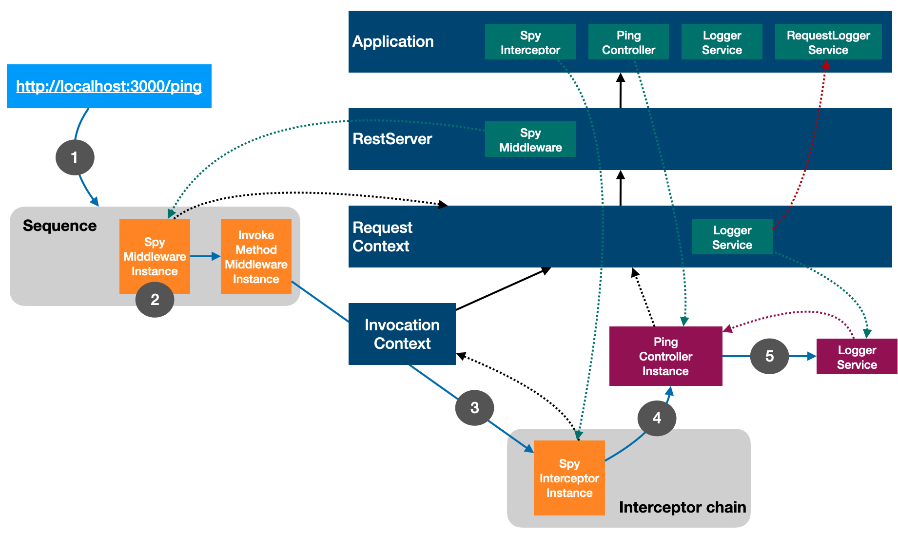

# binding-resolution

This example application is created to demonstrate LoopBack 4's context binding
resolution and dependency injection within a context hierarchy. The application
is verbosely instrumented to print out context/binding information to help
developers understand how bindings are resolved and injected based on the
resolution context, owner context, and binding scope.

## The application scenario



## The context chain

- Application
  - RestServer
    - RequestContext (for HTTP requests)
      - InvocationContext (for interceptors)

## Binding scopes for key artifacts

- Spy middleware (Singleton or transient)
- Spy interceptor (Singleton or transient)
- Ping controller (Transient or singleton)
- Logger service (Singleton)
- Request Logger service (Transient)

## Binding resolution and injection

1. `new BindingDemoApplication()` creates the application context
2. The `RestApplication` registers `RestComponent` to the application. As a
   result, the `RestServer` is bound to the application context. The
   `RestServer` instance is the server context.
3. `app.boot()` discovers and loads the following bindings into the application
   context:

   - PingController
   - SpyInterceptor
   - LoggerService
   - RequestLoggerService

4. `app.middleware(SpyMiddlewareProvider)` binds `middleware.Spy` to the server
   context.

5. When an HTTP request `http://localhost:/3000/ping` is sent, the rest server
   accepts the request, creates a `RequestContext` and dispatches it to the
   middleware sequence.

6. The `Spy` middleware is invoked. It creates `LOGGER_SERVICE` in the request
   context as an alias to `RequestLoggerService`.

7. The `PingController.ping` is mapped for the route. A new instance of
   `PingController` is created within the request context. Its dependency of
   `LOGGER_SERVICE` is resolved and injected into the controller with an
   instance of `RequestLoggerService`.

8. The `Spy` global interceptor is invoked and it has access to the invocation
   context.

9. The `ping` method of `PingController` is invoked. Method parameter injection
   is performed to supply the `requestCtx` parameter value.

10. The `ping` method calls `Logger` service.

## Use

```sh
DEBUG=loopback:example:binding-resolution npm start
```

To force binding scope to be `Transient`:

```
DEBUG=loopback:example:binding-resolution BINDING_SCOPE=transient npm start
```

Open http://localhost:3000/ping in your browser.

## Contributions

- [Guidelines](https://github.com/strongloop/loopback-next/blob/master/docs/CONTRIBUTING.md)
- [Join the team](https://github.com/strongloop/loopback-next/issues/110)

## Tests

Run `npm test` from the root folder.

## Contributors

See
[all contributors](https://github.com/strongloop/loopback-next/graphs/contributors).

## License

MIT
